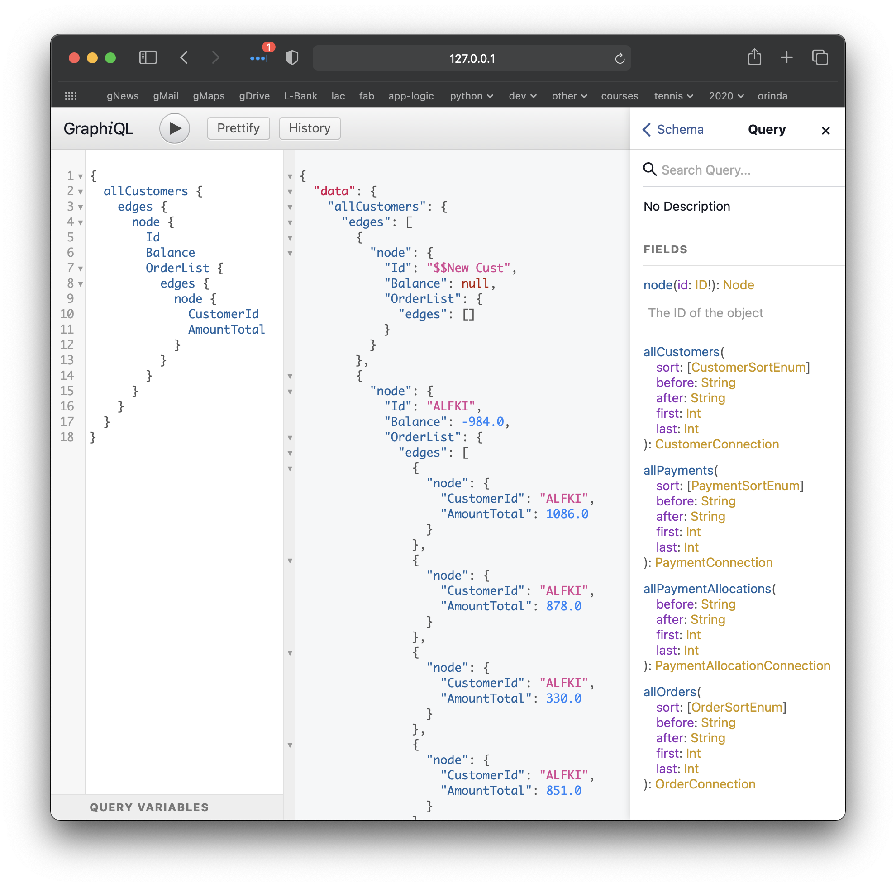

Example: Graphene + SQLAlchemy + LogicBank
==========================================

This example project demos integration between:

* [Graphene-SQLAlchemy](https://github.com/graphql-python/graphene-sqlalchemy)
and 
* [LogicBank](https://github.com/valhuber/LogicBank)

It is an adaption of [this example](https://github.com/graphql-python/graphene-sqlalchemy/tree/master/examples/flask_sqlalchemy).

See the [LogicBank Wiki](https://github.com/valhuber/LogicBank/wiki/Sample-Project---Allocation) for an overview of the ```payment_allocation``` application.

Background
----------
**GraphQL** (as I understand it) moves API definition from 
the server team (company, or org in company) to the consumers,
who clearly better understand their requirements.  Clear
specifications can reduce traffic, in either size and or
number of messages.  The focus is on **efficient retrieval.**

**Logic Base** can reduce update logic coding (a significant
part of any database app) by 40X, by using
spreadsheet-like rules plus Python for extensibility.  The
focus is on **update agility.**

Both are based on SQLAlchemy.  This project explores using
Graphene for retrieval, and Logic Base for mutation logic.

Getting started
---------------

First you'll need to get the source of the project. Do this by cloning the
whole Graphene-SQLAlchemy repository:

```bash
# Get the example project code
git clone https://github.com/valhuber/payment_allocation_graphene.git
```

It is good idea (but not required) to create a virtual environment
for this project. We'll do this using
[virtualenv](http://docs.python-guide.org/en/latest/dev/virtualenvs/)
to keep things simple,
but you may also find something like
[virtualenvwrapper](https://virtualenvwrapper.readthedocs.org/en/latest/)
to be useful:

```bash
# Create a virtualenv in which we can install the dependencies
cd payment_allocation_graphene
virtualenv venv
source venv/bin/activate
```

Now we can install our dependencies:

```bash
pip install -r requirements.txt
```

Verify LogicBank
----------------

```bash
cd payment_allocation/tests
python add_payment.py
```

Explore Graphene
----------------
Now the following command will setup the database, and start the server:

```bash
chmod +x app.py
./app.py
```

#### Retrieval Example

###### Resolved Issue
Patterning the code after [this example](https://github.com/graphql-python/graphene-sqlalchemy/tree/master/examples/flask_sqlalchemy),
gets **fail** with ```Request' object has no attribute 'get'```.

Mentioned in this [stack overflow](https://github.com/graphql-python/graphene-sqlalchemy/issues/130),
which links to [this](https://github.com/graphql-python/graphene-sqlalchemy/issues/286).

Also tried [this](https://github.com/graphql-python/graphene-sqlalchemy/issues/30)
(see app.py), but still fails.

But, the [suggestion here](https://github.com/graphql-python/graphene-sqlalchemy/issues/30)
worked, using @yoursdearboy's lambda (thank you! See ```app.py```):

```
app.add_url_rule(
  '/graphql',
  view_func=GraphQLView.as_view(
    'graphql',
    schema=schema,
    graphiql=True,
    get_context=lambda: {'session': db.session}
  )
)
``` 
###### Single Type
Open your browser to
[http://127.0.0.1:5000/graphql](http://127.0.0.1:5000/graphql)
and paste in the request below:

```
{
  allCustomers(sort: [ID_ASC]) {
    edges {
      node {
        Id
        Balance
      }
    }
  }
}
```


###### Multi-type
Using your command line:
```
cd tests
python test_get.py
```
Or, open your browser to
[http://127.0.0.1:5000/graphql](http://127.0.0.1:5000/graphql)
and paste in the request below:

```
{
  allCustomers {
    edges {
      node {
        Id
        Balance
        OrderList {
          edges {
            node {
              CustomerId
              AmountTotal
            }
          }
        }
      }
    }
  }
}
```

<figure></figure>


#### Update Example - WIP
This fails: ```Schema is not configured for mutations```.

Such configuration appears to be [quite code intensive](https://docs.graphene-python.org/en/latest/types/mutations/),
but possibly create from model.  There appears to be some
[promising work](https://github.com/goodking-bq/graphene-sqlalchemy-auto) in
this area.

```
mutation {
  customerCreate
    ( input:
        {
            Id: "ADDED",
            CompanyName: "Added, Inc",
            Balance: 0,
            CreditLimit: 0
        }
    )
    { customer {
      id
    }
  }
}
```
